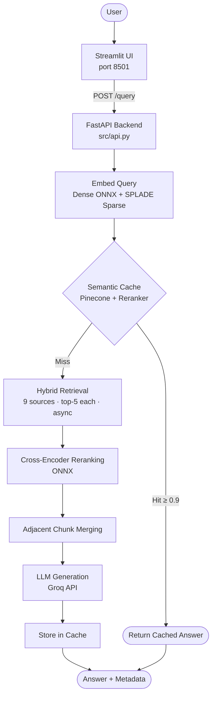
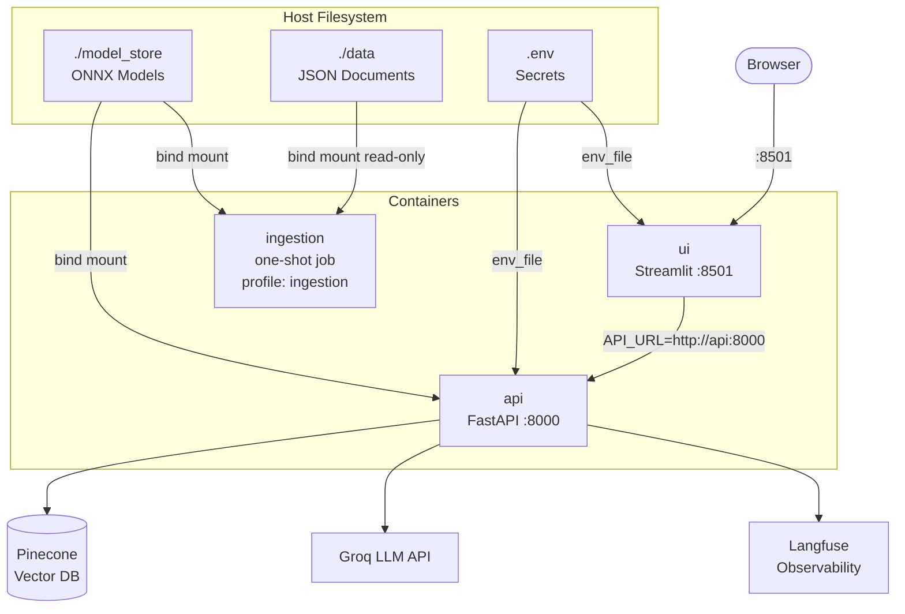
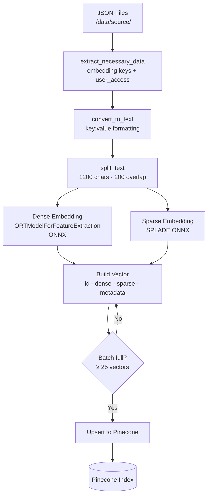
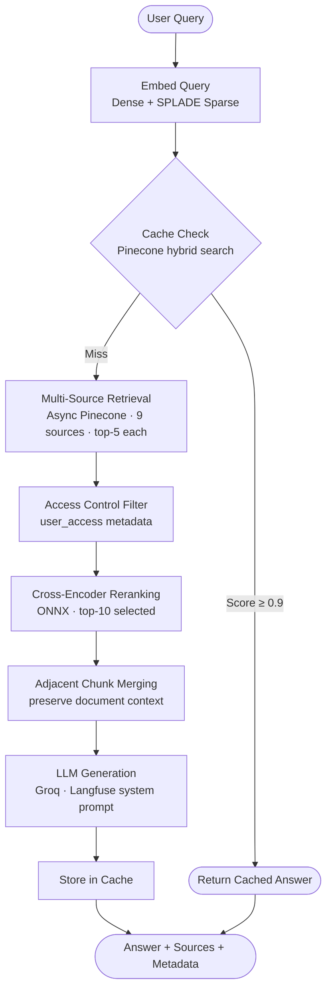

# EnterpriseRAG

A production-grade Retrieval-Augmented Generation (RAG) system for querying enterprise knowledge across multiple data sources. It combines hybrid search (dense + sparse embeddings), semantic caching, cross-encoder reranking, and an LLM generation step — all served via a FastAPI backend with a Streamlit UI.

---

## Architecture Overview

### Query Pipeline



### Docker Services



---

## Project Structure

```
.
├── src/
│   ├── api.py                  # FastAPI app with /query, /health endpoints
│   ├── ui.py                   # Streamlit chat frontend
│   │
│   ├── ingestion/              # Data ingestion pipeline
│   │   ├── main.py             # Orchestrates file processing & upsertion
│   │   ├── embedder.py         # Dense + sparse embedding for ingestion
│   │   ├── text_processor.py   # JSON → text conversion + chunking
│   │   ├── key_extractor.py    # LLM-based schema key extraction
│   │   ├── vector_store.py     # Pinecone index creation & upsert
│   │   ├── prompts.py          # Langfuse-managed prompts
│   │   └── config.py
│   │
│   ├── retrieval/              # Query-time retrieval
│   │   ├── query.py            # Retrieval orchestration
│   │   ├── embedder.py         # ONNX dense + SPLADE sparse embedders
│   │   ├── reranker.py         # ONNX cross-encoder reranker
│   │   ├── vector_store.py     # Pinecone async multi-source querying
│   │   ├── chunk_utils.py      # Adjacent chunk merging logic
│   │   └── config.py
│   │
│   ├── cache/                  # Semantic query cache
│   │   ├── main.py             # Cache check & store logic
│   │   └── config.py
│   │
│   ├── generation/             # LLM response generation
│   │   ├── main.py             # Full pipeline: embed → cache → retrieve → generate
│   │   ├── generator.py        # Groq/OpenAI-compatible generation call
│   │   └── config.py
│   │
│   ├── evaluate/               # Evaluation framework
│   │   └── enterprise-rag-evaluation.ipynb
│   │
│   └── utils/
│       ├── logger.py           # Centralized logging
│       └── check_device.py     # CUDA / CPU ONNX provider detection
│
├── docker/
│   ├── Dockerfile.api          # FastAPI + full ONNX/ML stack
│   └── Dockerfile.ui           # Streamlit only (lightweight)
├── requirements/
│   ├── base.txt                # Shared deps
│   ├── ml.txt                  # ONNX/transformers stack
│   ├── api.txt                 # API + ML
│   └── ui.txt                  # UI only
├── docker-compose.yml
├── requirements.txt
└── .gitignore
```

---

## Setup

### 1. Install dependencies

```bash
pip install -r requirements.txt
```

> For GPU support with ONNX Runtime:
> ```bash
> pip install onnxruntime-gpu
> ```

### 2. Configure environment

Create a `.env` file in the project root:

```env
# Pinecone
PINECONE_API_KEY=
PINECONE_INDEX_NAME=
PINECONE_NAMESPACE=
PINECONE_CACHE_NAMESPACE=
PINECONE_DIMENSION=
PINECONE_METRIC=
PINECONE_CLOUD=
PINECONE_REGION=

# Models
DENSE_EMBEDDING_MODEL=        # e.g. BAAI/bge-large-en-v1.5
DENSE_EMBEDDING_ONNX_FILE=    # e.g. model_optimized.onnx
SPARSE_EMBEDDING_MODEL=       # e.g. naver/splade-cocondenser-ensemble-distil
SPARSE_EMBEDDING_ONNX_FILE=   # e.g. model.onnx
RERANKING_MODEL=              # e.g. cross-encoder/ms-marco-MiniLM-L-6-v2
RERANKING_ONNX_FILE=          # e.g. model.onnx

# Groq (LLM generation)
GROQ_API_KEY=
GROQ_BASE_URL=
GROQ_GENERATION_MODEL=
EVALUATION_MODEL=

# Langfuse (observability & prompt management)
LANGFUSE_PUBLIC_KEY=
LANGFUSE_SECRET_KEY=
LANGFUSE_HOST=

# HuggingFace
HF_TOKEN=

# Logging
LOG_LEVEL=INFO
```

---

## Running the System

### With Docker (recommended)

Ensure `./model_store/` exists with downloaded ONNX models and a `.env` file is present.

```bash
# Start API + UI
docker compose up --build
```

| URL | Service |
|---|---|
| `http://localhost:8501` | Streamlit UI |
| `http://localhost:8000/docs` | API Swagger UI |
| `http://localhost:8000/health` | API health check |

The API loads ONNX models on startup — allow ~1–2 minutes before the UI becomes responsive.

**Run ingestion (one-shot, if Pinecone index is empty):**

```bash
docker compose --profile ingestion run --rm ingestion
```

---

### Without Docker

**Start the API server:**

```bash
uvicorn src.api:app --host 0.0.0.0 --port 8000 --reload
```

**Start the Streamlit UI:**

```bash
streamlit run src/ui.py
```

---

## API Reference

### `GET /health`
Returns pipeline status.

```json
{ "status": "healthy", "pipeline_loaded": true }
```

### `POST /query`
Submit a question to the RAG system.

**Request:**
```json
{ "question": "What are the SLA commitments for the healthcare client?" }
```

**Response:**
```json
{
  "answer": "...",
  "is_cached": false,
  "tokens_used": 842,
  "time_taken": 3.21
}
```

Swagger UI available at `http://localhost:8000/docs`.

---

## Data Ingestion

Place your JSON documents under a `./data/` directory structured by source (e.g. `data/confluence/`, `data/github/`, etc.).

### Ingestion Pipeline



Run ingestion:

```bash
python -m src.ingestion.main
```

Each JSON file is processed as follows:

1. Schema keys are extracted to determine what gets embedded vs. stored as metadata. Participant fields (`author`, `reviewers`, `assignee`, etc.) are collected into `user_access` for access-controlled retrieval.
2. Content is converted to plain text and split into overlapping chunks (default: 1200 chars, 200 overlap).
3. Each chunk is embedded with both dense and sparse models and upserted into Pinecone in batches of 25.

Supported sources: `confluence`, `fireflies`, `github`, `gmail`, `google_drive`, `hubspot`, `jira`, `linear`, `slack`.

---

## Retrieval Pipeline



At query time:

1. **Embedding** — the query is embedded with both the dense (ONNX) model and the SPLADE sparse model. Hybrid scores are computed with a configurable alpha (default `0.5`).
2. **Cache lookup** — a hybrid search against the cache namespace checks for a semantically similar past query. Results above the reranker threshold (`0.9`) are returned immediately.
3. **Multi-source retrieval** — async Pinecone queries are issued in parallel across all 9 sources (top-5 per source by default), filtered by `user_access`.
4. **Reranking** — a cross-encoder reranker scores all retrieved chunks against the query and selects the top-N.
5. **Chunk merging** — adjacent retrieved chunks from the same document are merged to preserve context.
6. **Generation** — the merged context is passed to the Groq LLM with a Langfuse-managed system prompt.

---

## Evaluation

Evaluation is run offline against a golden dataset using DeepEval and Groq, with scores logged to Langfuse. The notebook is at `src/evaluate/enterprise-rag-evaluation.ipynb`.

### Results

| Metric | Score | Description |
|---|---|---|
| **Faithfulness** | **0.9370** | How factually grounded the answer is in the retrieved context |
| **Recall@10** | **0.8860** | Fraction of relevant documents found in top-10 retrieval results |
| **Recall@5** | **0.8860** | Fraction of relevant documents found in top-5 retrieval results |
| **MRR** | **0.8800** | Mean Reciprocal Rank — how highly the first relevant document is ranked |
| **Answer Relevancy** | **0.8450** | How directly the generated answer addresses the question |
| **Context Recall** | **0.7720** | Coverage of ground-truth information in retrieved context |
| **Answer Correctness** | **0.7420** | Factual accuracy of the answer vs. ground truth |

---

## Key Configuration Parameters

| Parameter | Location | Default | Description |
|---|---|---|---|
| `TOP_K_PER_SOURCE` | `retrieval/config.py` | `5` | Chunks retrieved per source |
| `RERANK_TOP_N` | `retrieval/config.py` | `10` | Final chunks kept after reranking |
| `HYBRID_ALPHA` | `retrieval/config.py` | `0.5` | Dense vs. sparse weight (1 = dense only) |
| `RERANK_THRESHOLD` | `retrieval/config.py` | `0.5` | Minimum reranker score to include a chunk |
| `CACHE_SCORE_THRESHOLD` | `cache/config.py` | `0.9` | Reranker score threshold for cache hit |
| `CACHE_SEMANTIC_TOP_K` | `cache/config.py` | `5` | Candidates fetched from cache namespace |
| `CHUNK_SIZE` | `ingestion/config.py` | `1200` | Characters per chunk |
| `CHUNK_OVERLAP` | `ingestion/config.py` | `200` | Overlap between adjacent chunks |

---

## Model Storage

Downloaded and exported ONNX models are cached under `./model_store/` using the pattern `<model_name_with_slashes_replaced_by_underscores>/`. On subsequent startups, models are loaded from disk rather than re-downloaded.

---

## Observability

All prompts are managed in **Langfuse** and fetched at runtime by label (`production`). Retrieval and generation evaluation scores are logged as Langfuse spans. Set `LOG_LEVEL=DEBUG` in `.env` for verbose output.
